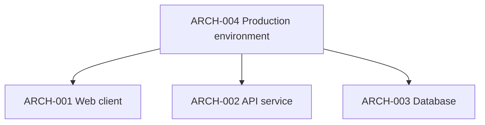

```mermaid
flowchart TB
  ARCH_004["ARCH-004 Production environment"] --> ARCH_001["ARCH-001 Web client"]
  ARCH_004 --> ARCH_002["ARCH-002 API service"]
  ARCH_004 --> ARCH_003["ARCH-003 Database"]
```
