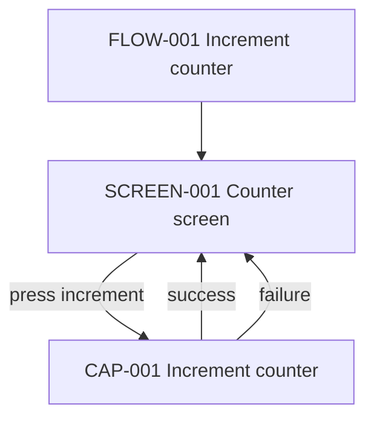

```mermaid
flowchart TD
  FLOW_001["FLOW-001 Increment counter"] --> SCREEN_001["SCREEN-001 Counter screen"]
  SCREEN_001 -->|press increment| CAP_001["CAP-001 Increment counter"]
  CAP_001 -->|success| SCREEN_001
  CAP_001 -->|failure| SCREEN_001
```
