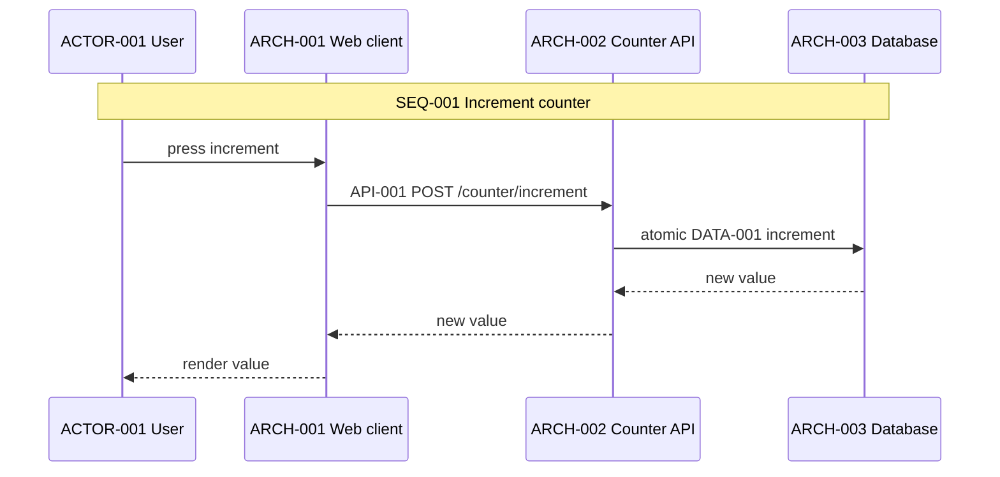

```mermaid
sequenceDiagram
  participant U as ACTOR-001 User
  participant W as ARCH-001 Web client
  participant A as ARCH-002 Counter API
  participant D as ARCH-003 Database
  Note over U,D: SEQ-001 Increment counter
  U->>W: press increment
  W->>A: API-001 POST /counter/increment
  A->>D: atomic DATA-001 increment
  D-->>A: new value
  A-->>W: new value
  W-->>U: render value
```
