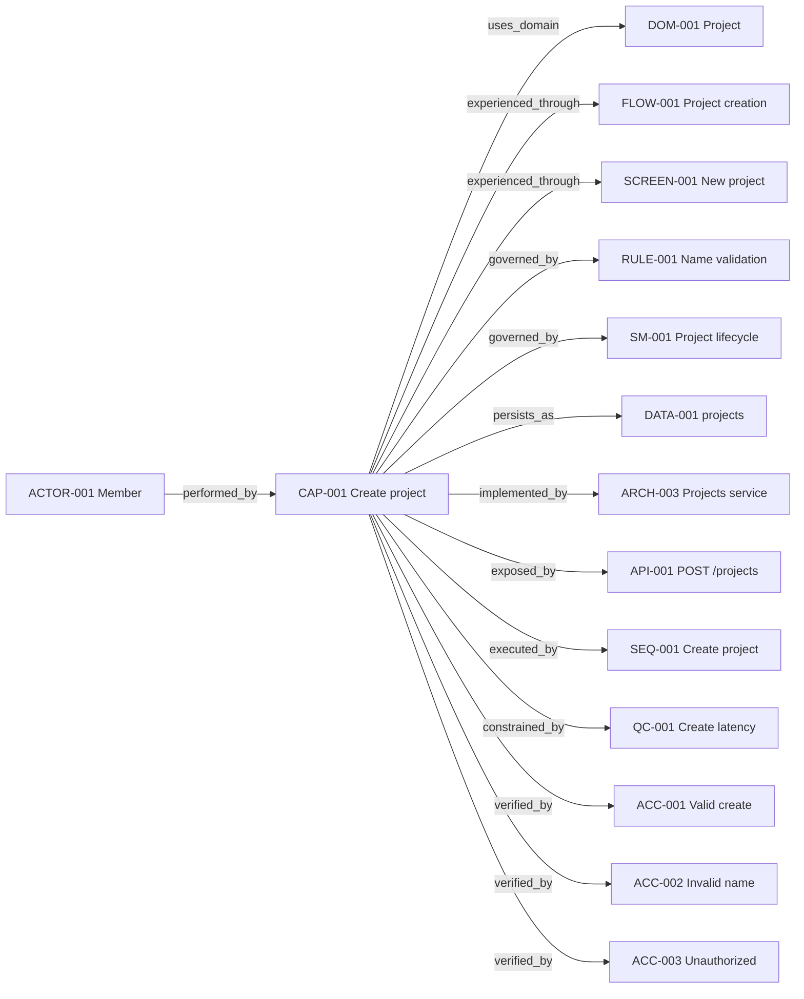
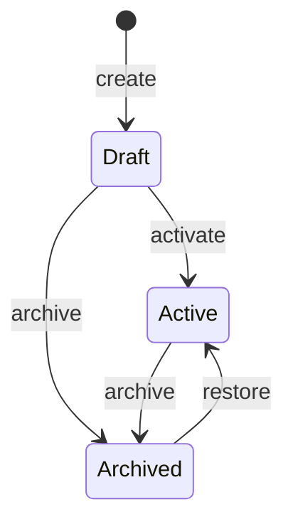

# Example: One Fully Traced Capability Slice

This example is illustrative, not a product default.

## Capability

`CAP-001 — Create project`

```json
{
  "id": "CAP-001",
  "name": "Create project",
  "actor_ids": ["ACTOR-001"],
  "coverage_requirements": {
    "domain": true,
    "experience": true,
    "behavior": true,
    "data": true,
    "architecture": true,
    "contracts": true,
    "sequence": true,
    "quality": true,
    "verification": true
  },
  "coverage_exceptions": {}
}
```

## Connected structures



## Decision table

| Authenticated | Has create permission | Name valid | Result |
|---|---|---|---|
| no | * | * | reject unauthenticated; no write |
| yes | no | * | reject forbidden; no write |
| yes | yes | no | validation error; preserve form input |
| yes | yes | yes | create project; return project; emit event |

## State machine



## Acceptance records

```json
[
  {
    "id": "ACC-001",
    "capability_ids": ["CAP-001"],
    "given": ["authenticated member", "create permission", "valid unique name"],
    "when": "submit create-project action",
    "then": ["one project is persisted", "response identifies project", "project.created is emitted once"]
  },
  {
    "id": "ACC-002",
    "capability_ids": ["CAP-001"],
    "given": ["authenticated member", "invalid name"],
    "when": "submit create-project action",
    "then": ["validation error identifies name rule", "no project is persisted", "entered values remain available"]
  }
]
```

The labels may be concise because the stable IDs connect the full intent. No artifact repeats all behavior.
