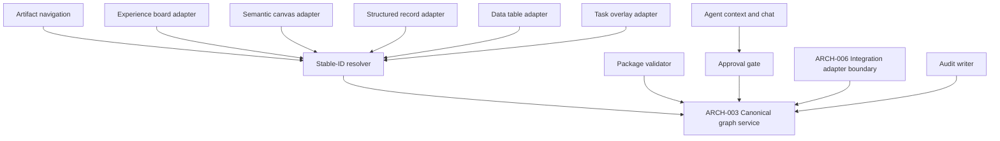

# Component boundaries

Each component owns one responsibility in the proposed graph. No component may
write canonical intent through a view adapter without the graph service rules.

The descriptive subcomponent labels stay inside the registered `ARCH-003`,
`ARCH-004`, and `ARCH-005` boundaries.
