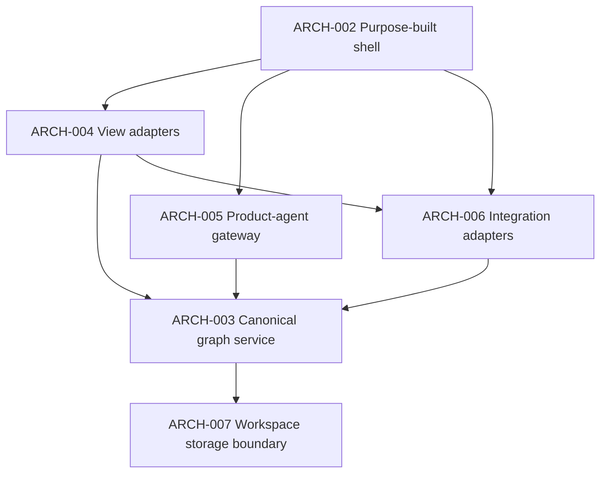

# Container model

The container split is proposed. It keeps view rendering separate from graph
mutation and external side effects.

`ARCH-007` is a boundary, not a chosen database. Local versus hosted storage
is an open question.
