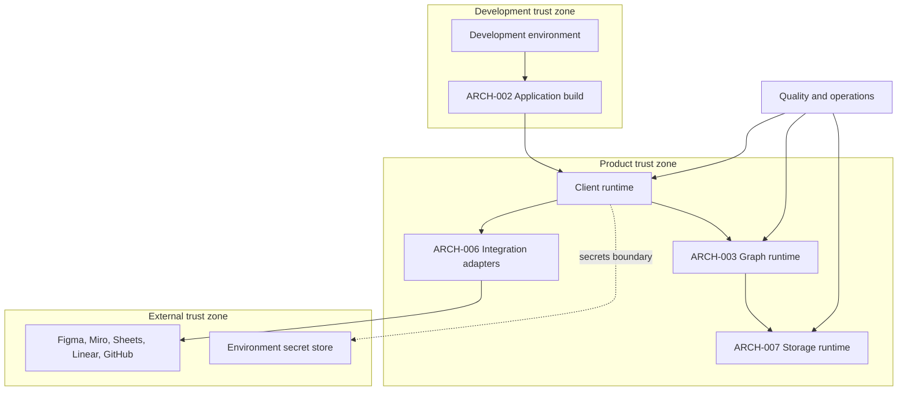

# Deployment topology

Deployment is proposed and depends on the local versus hosted workspace
decision. The diagram shows boundaries that must remain explicit in either
deployment mode.

```mermaid
flowchart TB
  DEV["Development environment"] --> BUILD["ARCH-002 Application build"]
  BUILD --> CLIENT["Client runtime"]
  CLIENT --> GRAPH["ARCH-003 Graph runtime"]
  GRAPH --> STORE["ARCH-007 Storage runtime"]
  CLIENT --> ADAPTERS["ARCH-006 Integration adapters"]
  ADAPTERS --> EXTERNAL["Figma, Miro, Sheets, Linear, GitHub"]
  OPS["Quality and operations"] --> CLIENT
  OPS --> GRAPH
  OPS --> STORE
  CLIENT -. secrets boundary .-> SECRETS["Environment secret store"]
  subgraph DEV_ZONE["Development trust zone"]
    DEV
    BUILD
  end
  subgraph PRODUCT_ZONE["Product trust zone"]
    CLIENT
    GRAPH
    STORE
    ADAPTERS
  end
  subgraph EXTERNAL_ZONE["External trust zone"]
    EXTERNAL
    SECRETS
  end
```
