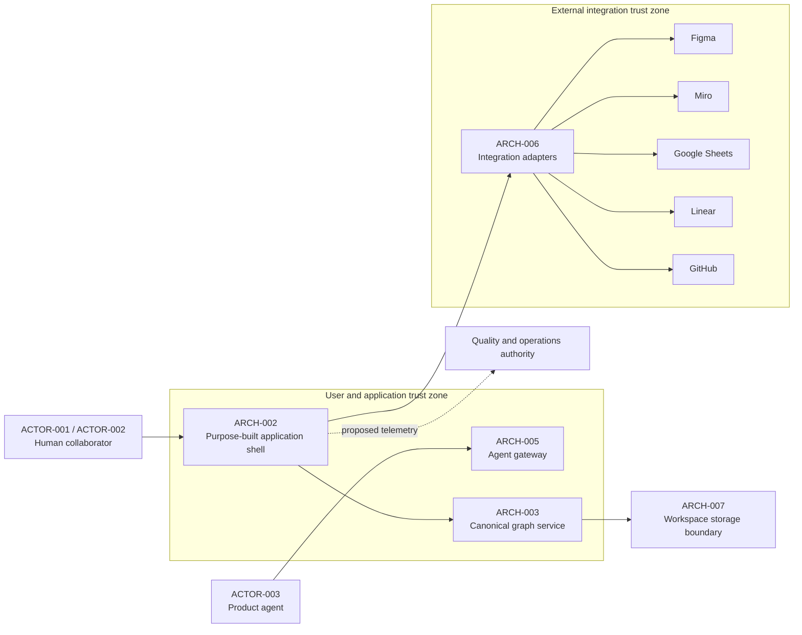

# System context

This context is a proposed boundary for the first product. The application
shell owns the canonical graph. External systems are separate trust zones and
must not be treated as available until their access and integration depth are
confirmed.

