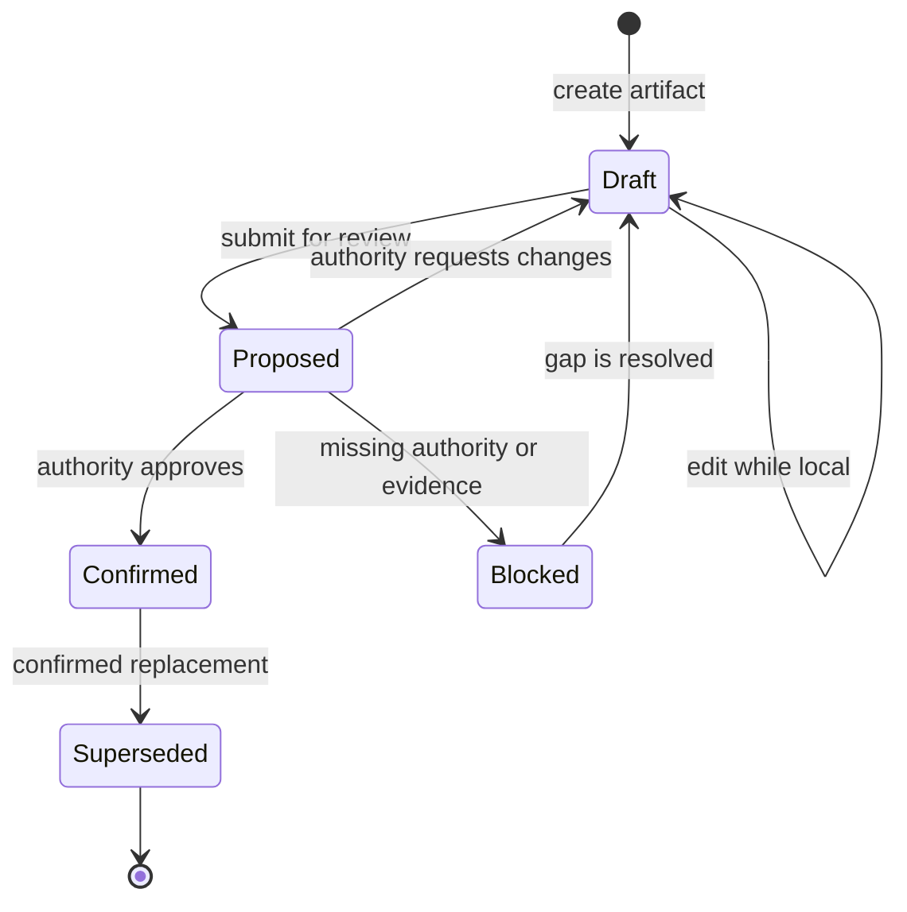
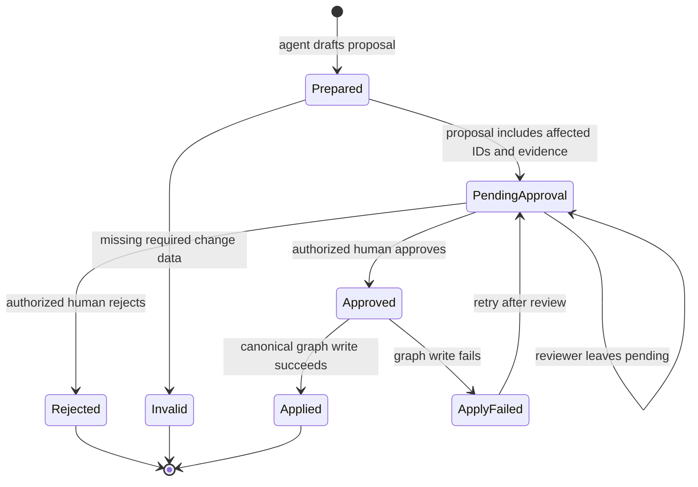

# Behavior state machines

The state machines below are proposed behavior. They show the required approval
gate and the separation between intent and execution. Exact permissions and
concurrency rules remain open questions.

## Artifact lifecycle

`SM-001` transitions require the following guards:

- Draft to Proposed checks structural validation and stable-ID uniqueness.
- Proposed to Confirmed requires the authority for the affected decision domain
  and a `DEC-*` record.
- Proposed to Blocked records the missing evidence, authority, or question.
- Confirmed to Superseded keeps the old ID in history and points to the new ID.

## Product-agent proposal lifecycle

`SM-002` never allows the product agent to move a proposal to `Approved` or
`Applied`. A failed apply keeps the proposal and its affected IDs available for
review.
