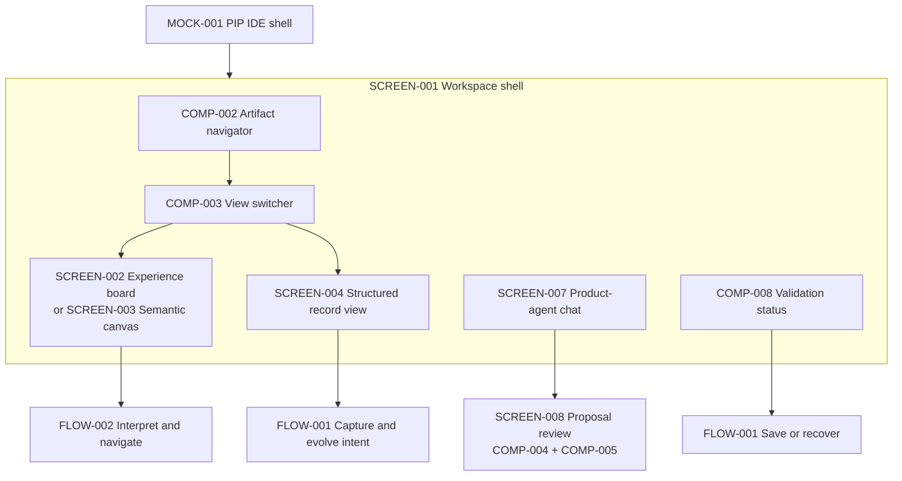

# PIP IDE shell mockup

`MOCK-001` is a proposed wireframe for `SCREEN-001` and the first view surfaces.
It is a working model, not a confirmed visual design. The supplied Figma file is
the design source: [IP IDE Experience](https://www.figma.com/design/NMUiwN7LaOsPrsQO3KPP4W/IP-IDE-Experience?node-id=4-17).

