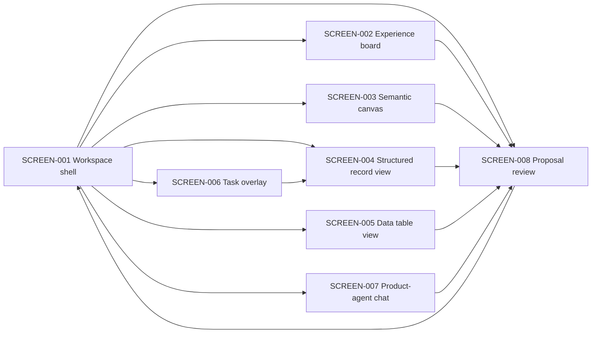

# Surface topology

The shell keeps the package graph visible while the user switches the working
view. The draft names and topology are proposed and need design confirmation.

```mermaid
flowchart LR
  SCREEN_001["SCREEN-001 Workspace shell"] --> SCREEN_002["SCREEN-002 Experience board"]
  SCREEN_001 --> SCREEN_003["SCREEN-003 Semantic canvas"]
  SCREEN_001 --> SCREEN_004["SCREEN-004 Structured record view"]
  SCREEN_001 --> SCREEN_005["SCREEN-005 Data table view"]
  SCREEN_001 --> SCREEN_006["SCREEN-006 Task overlay"]
  SCREEN_001 --> SCREEN_007["SCREEN-007 Product-agent chat"]
  SCREEN_001 --> SCREEN_008["SCREEN-008 Proposal review"]
  SCREEN_002 --> SCREEN_008
  SCREEN_003 --> SCREEN_008
  SCREEN_004 --> SCREEN_008
  SCREEN_005 --> SCREEN_008
  SCREEN_006 --> SCREEN_004
  SCREEN_007 --> SCREEN_008
  SCREEN_008 --> SCREEN_001
```
