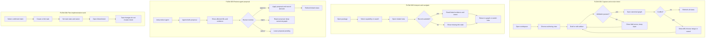

# User flows

The flows use the same package graph. Each flow includes a failure or recovery
branch because a view can be incomplete, unavailable, or in conflict.

```mermaid
flowchart TD
  subgraph FLOW_001["FLOW-001 Capture and evolve intent"]
    F1["Open workspace"] --> F2["Choose authoring view"]
    F2 --> F3["Draft or edit artifact"]
    F3 --> F4{"Validation passes?"}
    F4 -->|yes| F5["Save canonical graph"]
    F4 -->|no| F6["Show field errors; keep input"]
    F6 --> F3
    F5 --> F7{"Conflict?"}
    F7 -->|no| F8["Refresh all views"]
    F7 -->|yes| F9["Show diff; choose merge or cancel"]
    F9 --> F3
  end
  subgraph FLOW_002["FLOW-002 Interpret and navigate"]
    R1["Open package"] --> R2["Select capability or search"]
    R2 --> R3["Open related view"]
    R3 --> R4{"Record available?"}
    R4 -->|yes| R5["Read linked evidence and intent"]
    R4 -->|no| R6["Show missing-link state"]
    R5 --> R7["Return to graph or switch view"]
    R6 --> R7
  end
  subgraph FLOW_003["FLOW-003 Review agent proposal"]
    A1["Ask product agent"] --> A2["Agent drafts proposal"]
    A2 --> A3["Show affected IDs and evidence"]
    A3 --> A4{"Human reviews"}
    A4 -->|approve| A5["Apply proposal and record decision"]
    A4 -->|reject| A6["Reject proposal; keep canonical graph"]
    A4 -->|cancel| A7["Leave proposal pending"]
    A5 --> A8["Refresh linked views"]
  end
  subgraph FLOW_004["FLOW-004 Plan implementation work"]
    T1["Select confirmed intent"] --> T2["Create or link task"]
    T2 --> T3["Set task state and owner"]
    T3 --> T4["Open linked intent"]
    T4 --> T5["Task changes do not mutate intent"]
  end
```
