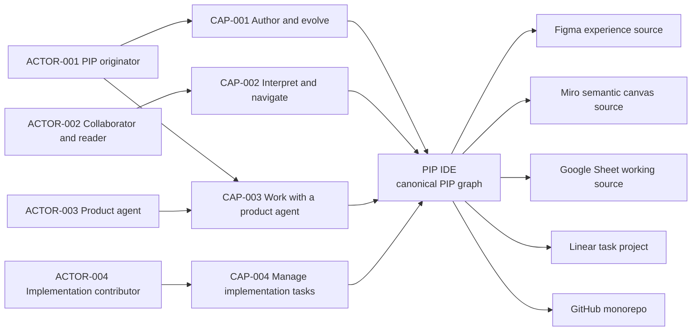

# Product map

The PIP IDE is the product boundary. The package graph is canonical. External
systems provide optional evidence or execution links. They do not become
canonical intent without a confirmed decision.

The current draft does not define account creation, billing, or hosted
collaboration. Those choices remain in the question ledger.
