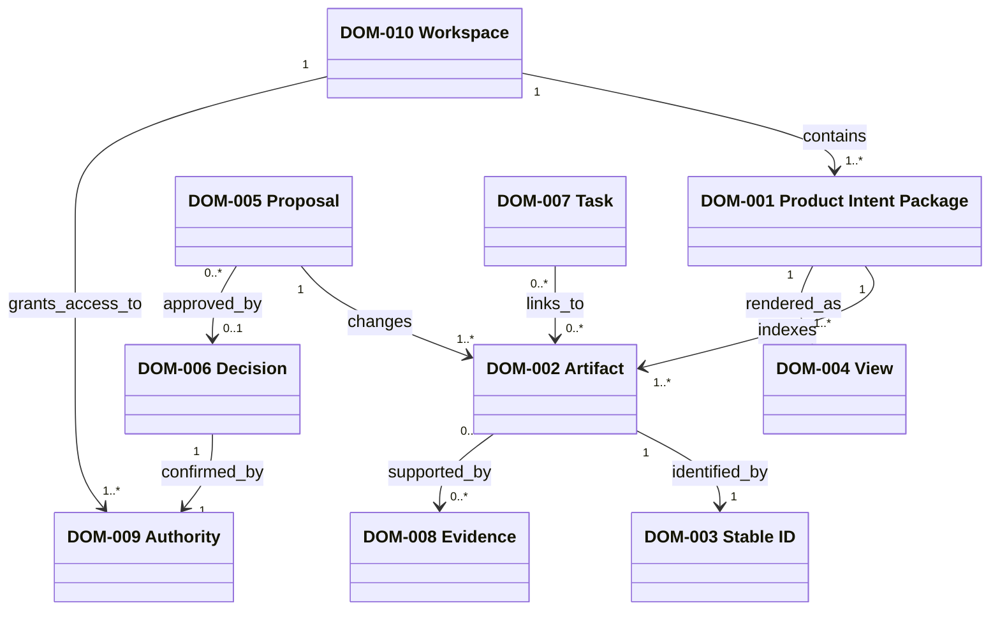

# Domain model

These are conceptual records. The physical schema is a proposed mapping in the
data structure. A stable ID is immutable. A view can change its layout without
changing the package artifact it represents.

Invariants:

- `DOM-001` has one active package version per workspace and target version.
- `DOM-002` keeps its `DOM-003` stable ID across view changes.
- `DOM-005` cannot mutate `DOM-001` until `DOM-006` records the required human approval.
- `DOM-007` may link to an artifact, but task state does not alter that artifact.
- `DOM-008` can explain a proposal. Evidence alone cannot confirm intent.
