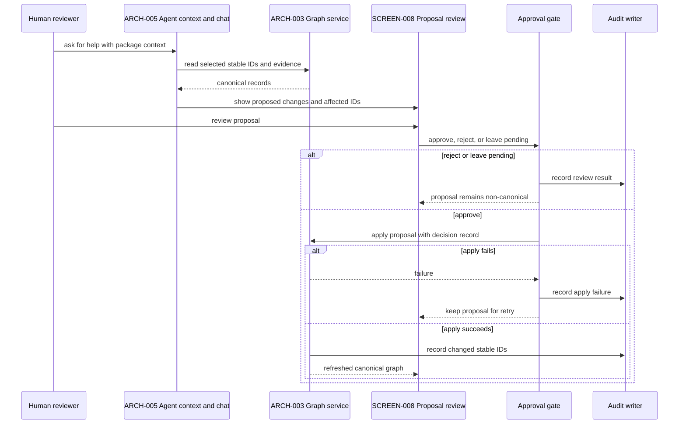
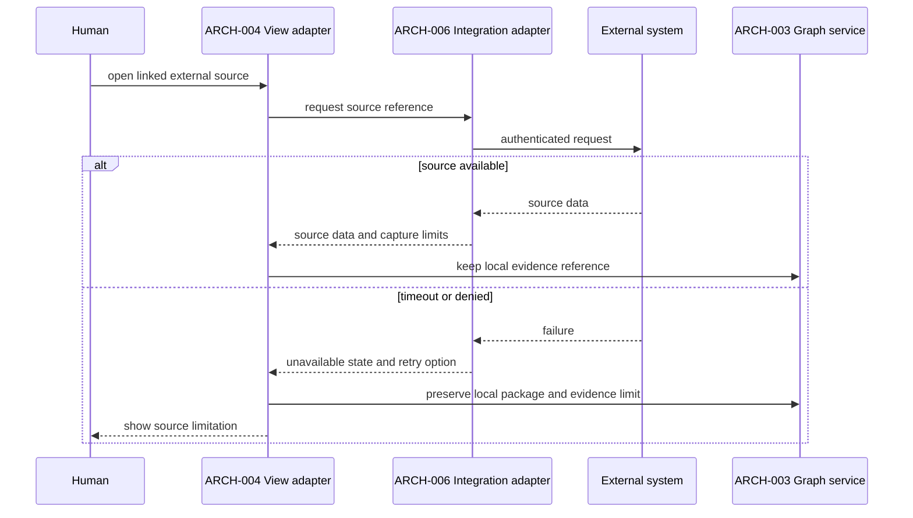

# Runtime sequences

The sequences are proposed coordination rules. They make graph writes, approval
gates, and integration failures observable.

## Save an author edit

```mermaid
sequenceDiagram
  participant H as Human
  participant V as ARCH-004 View adapter
  participant G as ARCH-003 Graph service
  participant P as Package validator
  participant S as ARCH-007 Storage boundary
  participant O as Audit writer
  H->>V: edit artifact
  V->>G: PATCH with expected graph version
  G->>P: validate YAML and stable IDs
  P-->>G: pass or field errors
  alt validation fails
    G-->>V: validation error; no write
    V-->>H: preserve input and show error
  else validation passes
    G->>S: compare expected graph version
    alt graph conflict
      S-->>G: conflict
      G-->>V: 409 and conflicting records
      V-->>H: merge or cancel choice
    else current version
      G->>S: persist artifact and increment graph version
      G->>O: append audit event
      G-->>V: changed artifact and new version
      V-->>H: refresh linked views
    end
  end
```

## Review and apply an agent proposal



## Integration read failure


