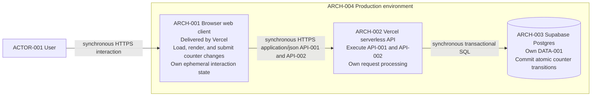

# Physical runtime stack

```mermaid
flowchart LR
  ACTOR_001["ACTOR-001 User"]
  subgraph ARCH_004["ARCH-004 Production environment"]
    ARCH_001["ARCH-001 Browser web client<br/>Delivered by Vercel<br/>Load, render, and submit counter changes<br/>Own ephemeral interaction state"]
    ARCH_002["ARCH-002 Vercel serverless API<br/>Execute API-001 and API-002<br/>Own request processing"]
    ARCH_003[("ARCH-003 Supabase Postgres<br/>Own DATA-001<br/>Commit atomic counter transitions")]
  end

  ACTOR_001 -->|synchronous HTTPS interaction| ARCH_001
  ARCH_001 -->|synchronous HTTPS application/json API-001 and API-002| ARCH_002
  ARCH_002 -->|synchronous transactional SQL| ARCH_003
```
