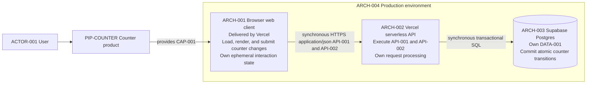

# Stack context

The Counter product is delivered as one simple production topology, so
deployment is shown in this context. A separate deployment diagram is not
needed.

`ARCH-004` contains the confirmed production deployment boundary. Vercel
delivers the web client and runs the serverless API. Supabase Postgres owns the
durable counter record and commits atomic transitions. Security and operational
controls apply to the relevant node or connection; they are not separate peer
services.
