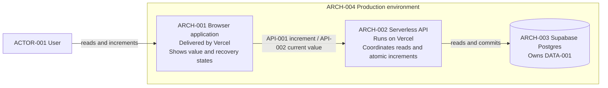

# Stack context

`ARCH-001` through `ARCH-004` provide `CAP-001`. `DEC-005` confirms these
physical deployment choices.

The browser owns only interaction state. The API owns request processing.
Supabase Postgres is authoritative for the counter value. Production backups
are enabled, and application rollback must preserve `DATA-001`. `SEQ-001` and
`SEQ-002` show the consequential communication among these nodes.
