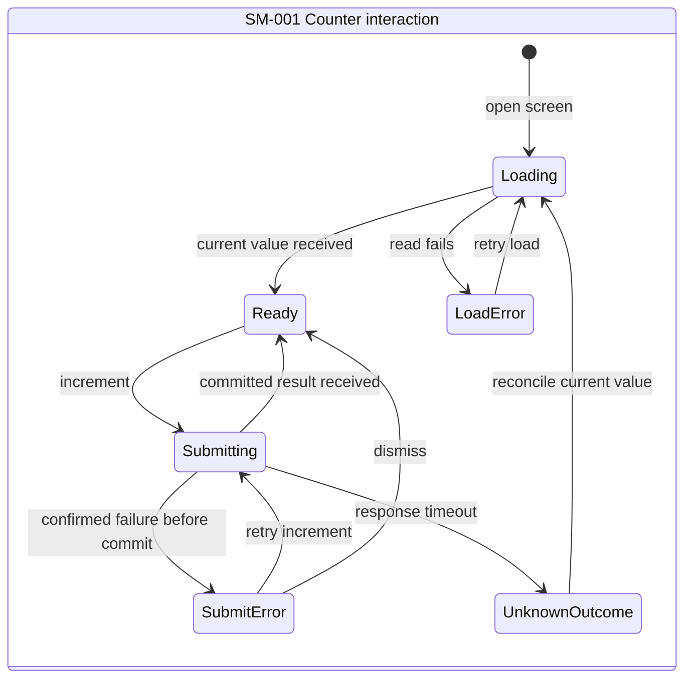

## SM-001 runtime transition allocation

The local start transition enters `Loading`. The table covers each transition
that uses a physical service.

| Transition | Initiator | Durable authority | Executor | Observers | Failure and recovery |
| --- | --- | --- | --- | --- | --- |
| `SM-001.transition-01` — `Ready` to `Submitting` | `ACTOR-001` through `ARCH-001` | None; no durable change occurs before acceptance | `ARCH-001` sends `API-001` to `ARCH-002` | `ACTOR-001` | `RULE-001`, `SEQ-001`, and `ACC-002` cover pre-commit failure |
| `SM-001.transition-02` — `Submitting` to `Ready` | `ARCH-002` after it accepts `API-001` | `ARCH-003` atomically commits `DATA-001` | `ARCH-002` returns the committed value and `ARCH-001` renders it | `ACTOR-001` | `RULE-001`, `SEQ-001`, and `ACC-001` cover the committed result |
| `SM-001.transition-03` — `Submitting` to `SubmitError` | `ARCH-002` returns the confirmed pre-commit failure | `ARCH-003` remains unchanged | `ARCH-001` shows the retry state | `ACTOR-001` | `RULE-001`, `SEQ-001`, and `ACC-002` require no mutation and a retry state |
| `SM-001.transition-04` — `SubmitError` to `Submitting` | `ACTOR-001` | None until a later accepted request commits | `ARCH-001` resends `API-001` | `ACTOR-001` | `ACC-002` permits retry; another failure returns to `SubmitError` |
| `SM-001.transition-05` — `SubmitError` to `Ready` | `ACTOR-001` dismisses the error | None; this is local interaction state | `ARCH-001` | `ACTOR-001` | `RULE-001` keeps `DATA-001` unchanged |
| `SM-001.transition-06` — `Loading` to `Ready` | `ACTOR-001` opens the screen, or `ARCH-001` starts reconciliation | `ARCH-003` owns the current `DATA-001` value | `ARCH-002` reads the value through `API-002`; `ARCH-001` renders it | `ACTOR-001` | `SEQ-002` and `ACC-004` cover the successful read |
| `SM-001.transition-07` — `Loading` to `LoadError` | `ARCH-002` returns a confirmed read failure | `ARCH-003` remains unchanged | `ARCH-001` shows the load retry state | `ACTOR-001` | `SEQ-002` and `ACC-004` require no mutation and allow retry |
| `SM-001.transition-08` — `LoadError` to `Loading` | `ACTOR-001` | None; this transition starts a read | `ARCH-001` resends `API-002` | `ACTOR-001` | Another read failure returns to `LoadError` |
| `SM-001.transition-09` — `Submitting` to `UnknownOutcome` | `ARCH-001` reaches its response timeout | `ARCH-003` may have committed `DATA-001`; the client cannot infer the result | `ARCH-001` blocks another increment and shows reconciliation | `ACTOR-001` | `RULE-001`, `SEQ-001`, and `ACC-005` prohibit an automatic resend |
| `SM-001.transition-10` — `UnknownOutcome` to `Loading` | `ARCH-001` | `ARCH-003` owns the current `DATA-001` value | `ARCH-001` starts `API-002` through `ARCH-002` | `ACTOR-001` | `SEQ-002` and `ACC-005` reconcile the persisted value before another increment |
