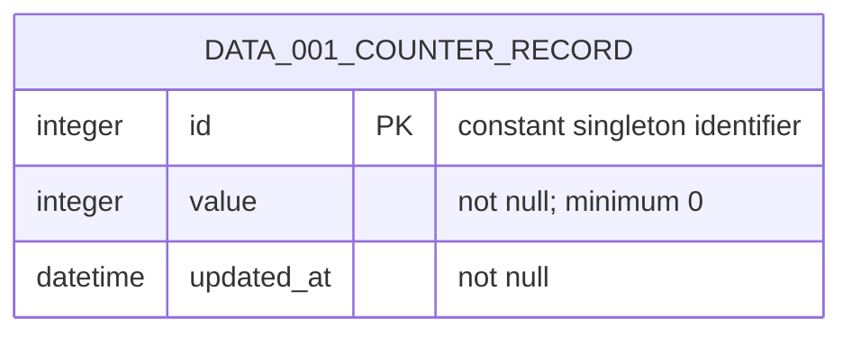

# Data model

`DOM-001 Counter` is represented by one `DATA-001 Counter record` owned by
`ARCH-003`.

There is exactly one counter record, seeded at deployment with `value: 0`.
Reads do not mutate it. An accepted increment changes `value` atomically by one;
a failure confirmed before commit does not change it. `RULE-001` owns those
behavioral requirements.

`DATA-001` is non-personal product data retained for the product lifetime.
Production backups or exports must make it recoverable, and application rollback
must not delete or reset it.
