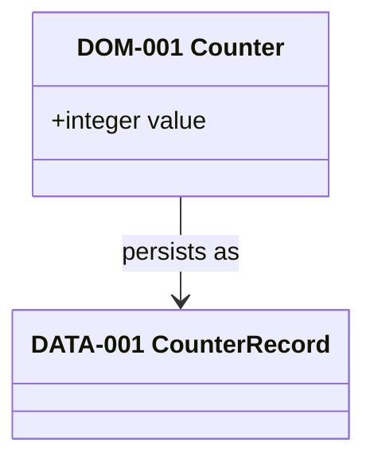
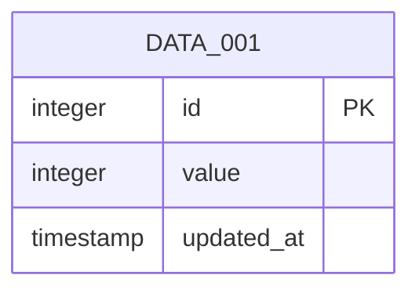

# Data model

The conceptual counter maps to one physical singleton record.

## Conceptual domain model

## Physical ERD

`DATA-001` is stored as `counter_record` in Supabase Postgres. The singleton
key and field constraints remain authoritative in `data/schema.yaml`.

| Domain concept | Physical record(s) | Mapping note |
| --- | --- | --- |
| `DOM-001 Counter` | `DATA-001 CounterRecord` | One conceptual counter maps to one singleton physical record. |
