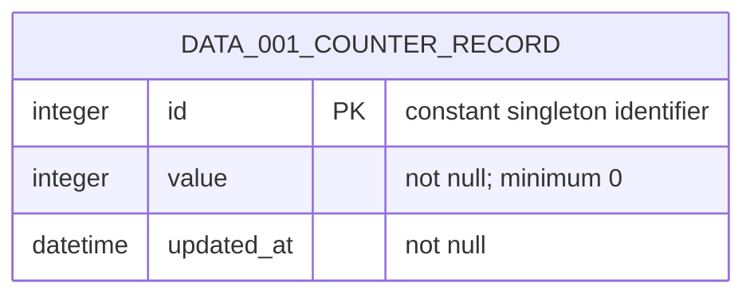

# Data model

`DOM-001 Counter` is represented by one `DATA-001 Counter record` owned by
`ARCH-003`.

There is exactly one counter record, seeded at deployment with `value: 0`.
Reads do not mutate it. `RULE-001` owns increment behavior.

## Current rationale

- One singleton record represents `DOM-001` because the product has one shared
  counter and excludes accounts and multi-tenancy.
- `value` is persisted and incremented atomically because otherwise concurrent
  accepted increments could be lost and a reload could show a nonauthoritative
  client value.
- `updated_at` records the latest durable change because operators need minimal
  context when diagnosing or restoring the shared value.
- `DATA-001` is retained for the product lifetime and protected by backups or
  exports because deployment, rollback, or infrastructure failure must not
  reset the product's state.
