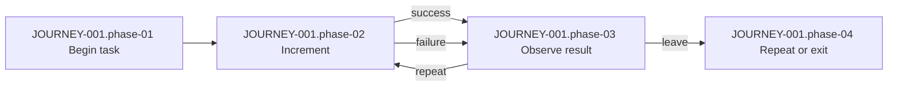

# JOURNEY-001: Increment and observe the counter

| Journey ID | Type | Actor | Scope | Target view | Intent status | Status | Trigger | Outcome | Recurrence | Authority | Decision | Version |
| --- | --- | --- | --- | --- | --- | --- | --- | --- | --- | --- | --- | --- |
| `JOURNEY-001` | `job_task` | `ACTOR-001` | Counter task | `intended_current` | `confirmed` | `confirmed` | Open Counter screen | Increase and observe value | Repeat until complete | `AUTH-OWNER` | `DEC-001` | 1 |

The actor can repeat the task or leave after an accepted increment. `JOURNEY-001` is the macro map; detailed behavior remains in the linked artifacts.

| Phase | Actor goal | Actor action | Product response | State/data | Exceptions and recovery | Linked artifacts |
| --- | --- | --- | --- | --- | --- | --- |
| Begin task | See the current value | Open the Counter screen | Display the persisted value | `SM-001`, `DATA-001` | `[DECISION]` Show retry when load fails | `FLOW-001`, `SCREEN-001`, `ACC-001` |
| Increment | Request one increment | Press the control once | Send one request and show submitting | `SM-001`, `API-001` | `[DECISION]` No mutation on failure; retry is allowed | `RULE-001`, `DT-001`, `ACC-002` |
| Observe result | Confirm the change | Read the value | Display the new value | `DATA-001`, `SM-001` | `[DECISION]` Retry or leave after failure | `FLOW-001`, `RULE-001`, `ACC-001`, `ACC-002` |
| Repeat or exit | Repeat or stop safely | Press again or leave | Start the next cycle or end with no extra mutation | `DATA-001`, `SM-001` | `[DECISION]` Leaving ends the task without a request | `FLOW-001`, `ACC-001` |

Evidence: `[EVIDENCE]` The fixture defines one actor, one Counter screen, one increment capability, and one persisted counter value. Authority: `[DECISION]` `DEC-001` confirms the actor, task boundary, phases, responses, and repeat behavior.
