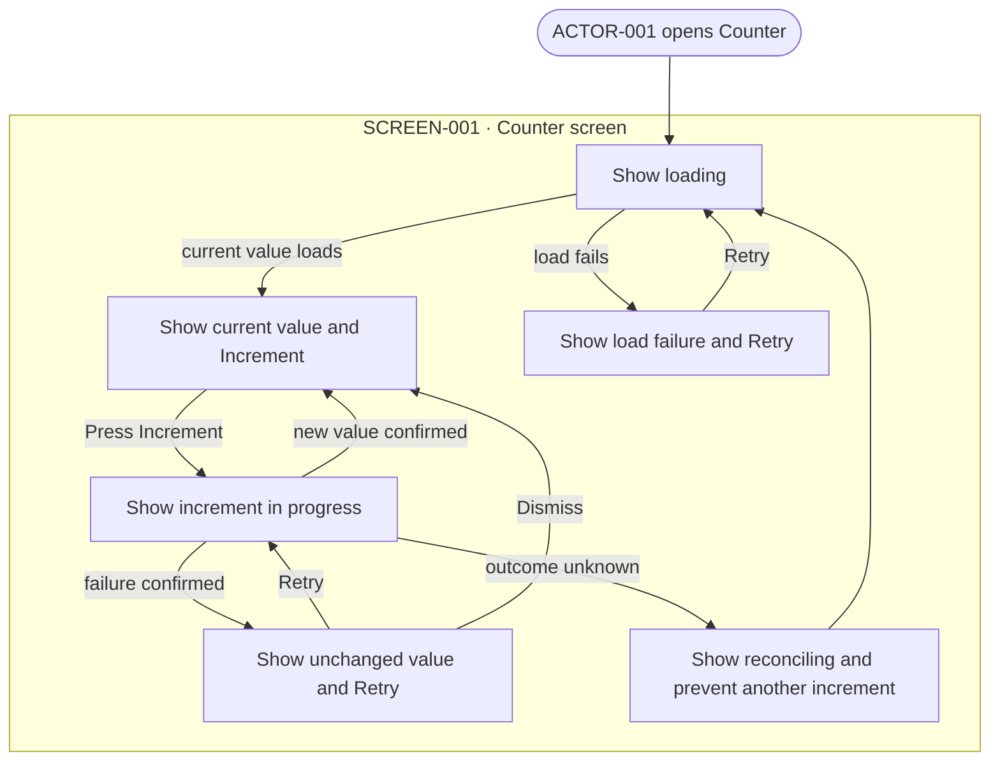

# User flows

## FLOW-001 Read and increment the counter

The flow takes place on `SCREEN-001 Counter screen`. Increment actions use
`SEQ-001`; initial loads, retries, and unknown-outcome reconciliation use
`SEQ-002`. Visible outcomes obey `RULE-001`.

The screen is a responsive, single centered column. Increment is a native,
keyboard-operable button, and loading, ready, error, submitting, and reconciling
state changes are announced to assistive technology. The screen uses no
animation.

The flow owns actor actions and visible outcomes. Runtime calls and commit
behavior belong to the linked sequences and `RULE-001`.
