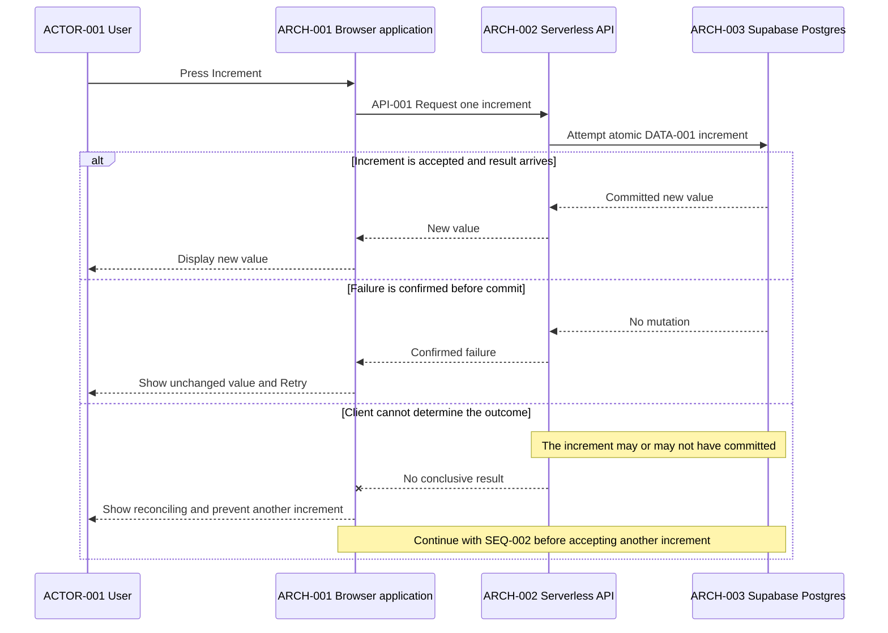
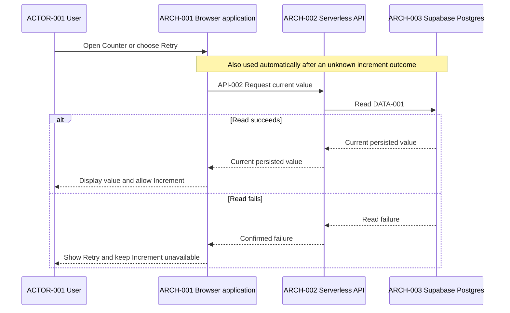

# Sequences

## SEQ-001 Increment once

This sequence applies `RULE-001` to `DATA-001` during `FLOW-001`.

## SEQ-002 Load or reconcile the current value

This sequence reads `DATA-001` for initial load, read retry, or reconciliation
during `FLOW-001`.

