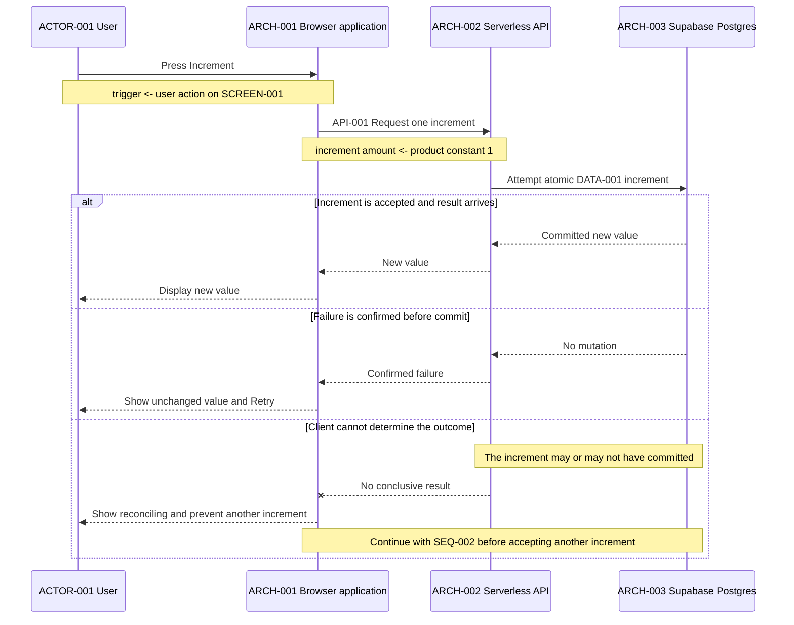
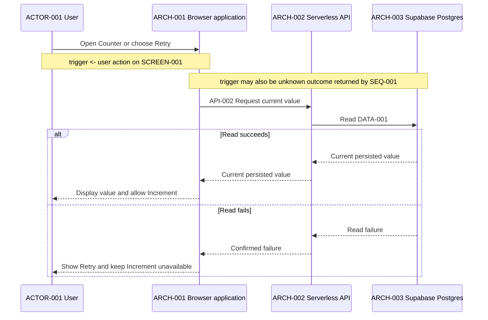

# Sequences

## SEQ-001 Increment once

This sequence applies `RULE-001` to `DATA-001` during `FLOW-001`.

**DCL:** 4 (product default)

### Current rationale

- The API requests one atomic database increment because a client-side read-
  then-write could lose concurrent accepted increments.
- A failure known to occur before commit may offer Retry because the value is
  known to be unchanged.
- An unknown outcome does not automatically retry because the first request may
  already have committed; `SEQ-002` must re-read durable state before another
  increment is allowed.

## SEQ-002 Load or reconcile the current value

This sequence reads `DATA-001` for initial load, read retry, or reconciliation
during `FLOW-001`.

**DCL:** 4 (product default)

### Current rationale

- Initial load, read retry, and unknown-outcome reconciliation use the same read
  process because each needs the current durable value without mutation.
- Increment remains unavailable after a read failure because the browser cannot
  safely present or mutate a value it has not reconciled with `DATA-001`.
